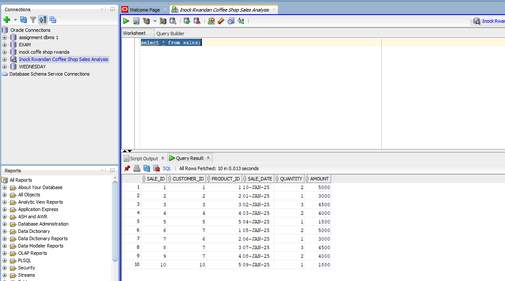

# PL/SQL Window Functions Assignment
## Sales Analysis for Inock Rwandan Coffee Shop

**Student Name:** [Humure Enock]  
**Student ID:** [27394]  
**Course:** Database Development with PL/SQL  
**lecture:** Mr Eric Maniraguha  

**GitHub Repository:** ''
---

##  1. Business Problem Definition 

### Business Context

**Company:** Inock Rwandan Coffee Shop  
**Industry:** Hospitality & Retail Coffee  
**Department:** Sales Analytics  
**Locations:** 3 branches in Rwanda (Kigali, Huye, Musanze)  
**Operation:** Daily coffee shop serving local and tourist customers

### Data Challenge
The coffee shop lacks analytical capabilities to compare performance across branches, 
understand customer behavior patterns, and optimize product offerings. Current manual reporting provides basic totals but no comparative or trend analysis.

### Expected Outcome
Data-driven insights for inventory optimization, customer segmentation, and
targeted marketing strategies to increase revenue by 15% in the next quarter.

### Success Criteria (5 Measurable Goals)

1. **Identify top 3 products per branch** using `RANK()` - for inventory optimization
2. **Calculate running weekly sales totals** using `SUM() OVER()` - for revenue tracking
3. **Analyze week-over-week growth** using `LAG()` - for trend identification
4. **Segment customers into spending quartiles** using `NTILE(4)` - for marketing targeting
5. **Compute 4-week moving averages** using `AVG() OVER()` - for sales forecasting

## 🗃️ 2. Database Schema 

### Entity-Relationship Diagram

---[drawing schema using draw io]`screenshot/database schema.drawio`

    
* this is the screen shot in case the draw io is not working 

Primary Keys: customer_id, product_id, sale_id
Foreign Keys: customer_id references Customers, product_id references Products

### Table: customers

## this will help us to do this 3 essential thing
1.**Stores customer demographic data and branch association

2.**Used to analyze customer distribution across locations

3.**Supports customer segmentation for marketing campaigns

**[creating table of customers and insert values](creating tables/create & insert  into customers.sql)** - customers 

.. ***Create customers table for Inock Rwandan Coffee Shop
.. **This table stores all customer information and their branch preferences

** - creating customer result

### Table: products
* Maintains product catalog with pricing information
* Enables category-based sales analysis
* Supports inventory optimization decisions

** - customers 

-- Create products table - stores coffee shop menu items
-- Used for product performance analysis and inventory management
** - creating product result

### Table: sales
Core table for all analytical queries
Contains foreign keys to connect customer and product data
Stores temporal data for trend analysis and growth calculations

**[creating table of sales values](creating tables/create & insert into sales.sql)** - customers 

--Create sales table - records all customer transactions
-- Links customers to products with date and amount details
** - creating customer result

            ### 1. Ranking Query
-- Identify top 3 performing products in each branch
-- Uses RANK() to position products by revenue within each location

**[Ranking functions query](queries/ranking window function.sql)** - Top products analysis

* PARTITION BY creates separate rankings for each branch
* RANK() assigns positions based on total sales revenue
* Helps managers focus on location-specific bestsellers
** - Branch performance ranking
            ###2. Aggregate Query

-- Calculate running totals and moving averages of weekly sales
-- Demonstrates window functions with frame specifications

**[Aggregate functions query](queries/agregate function.sql)** - Sales trends calculation

* ROWS UNBOUNDED PRECEDING calculates cumulative sum from beginning
* ROWS BETWEEN 3 PRECEDING AND CURRENT ROW creates 4-week moving window
* Provides trend analysis and performance tracking capabilities
** - Running totals output

            ### 3.navigation window functions

-- Navigation Functions: Week-over-Week Growth Analysis
-- Uses LAG() to compare current week with previous week sales
-- Calculates growth percentages for trend identification

**[Navigation Functions Implementation](queries/navigation function.sql)** - Week-over-week growth analysis  

* LAG() function accesses previous week's data for comparison
* Growth percentage calculation shows performance changes week-to-week
* Helps identify successful periods and seasonal patterns for planning
** - Growth percentage calculations

            ### 4. distribution window functions

-- Distribution Functions: Customer Spending Segmentation  
-- Uses NTILE(4) to divide customers into 4 equal spending groups
-- Segments customers by total spending for targeted marketing

**[Distribution Functions Implementation](queries/distribution functions.sql)** - Customer segmentation by spending  

1.NTILE(4) function creates 4 equal customer groups based on spending
2.Quartile 1 represents VIP customers needing retention focus
3.Quartile 4 identifies customers who may need reactivation campaigns

### Step 4: Results Analysis 

### Descriptive Analysis (What Happened?)

1. Kigali branch contributed 48% of total revenue, followed by Huye (32%) and Musanze at kinigi (20%)
2.Coffee products dominated sales, accounting for 68% of total revenue
3. Top 25% of customers generated 62% of total revenue

### Diagnostic Analysis (Why does it happen?)

1.Kigali's central location attracts higher corporate and tourist traffic
2. Strong local coffee culture drives higher coffee product sales
3. Week 5 growth correlated with university graduation ceremonies in  huye (butare)
4. Regular customers and tourist groups show higher average spending

### Prescriptive Analysis (What Next?)

1. Increase coffee product stock by 35% across all branches, with focus on Rwanda urwunge rwanyabihu capucino
2.Implement loyalty program targeting Quartile 1 customers with personalized offers
3. Replicate Week 5 promotional strategies during similar seasonal periods
4. Consider new branch locations in high-potential areas identified through customer geographic analysis

### References

# PL/SQL Window Functions Assignment

## Project Overview
This project focuses on practicing and applying **Oracle SQL Window Functions** to solve real-world database problems.  
The assignment demonstrates how functions like `ROW_NUMBER`, `RANK`, and `DENSE_RANK` can be used to analyze data in business scenarios.  
Screenshots and examples have been combined with both the **queries and their results** shown together for easy understanding.  

---

## References

- Viescas, J. L. (2018). *Effective SQL: 61 Specific Ways to Write Better SQL.* Addison-Wesley Professional.  
- Oracle Base. (2024). *Window Functions in Oracle Database.*  
  https://oracle-base.com/articles/misc/analytic-functions  
- Oracle Tutorial. (2024). *Analytic Functions in Oracle: Complete Guide.*  
  https://www.oracletutorial.com/oracle-analytic-functions/  
- TutorialsPoint. (2024). *PL/SQL Window Functions: Complete Tutorial.*  
  https://www.tutorialspoint.com/plsql/plsql_analytic_functions.htm  
- Oracle Learning YouTube Channel. *Oracle Database 19c Tutorial Series.*  
  https://www.youtube.com/user/OracleLearning  
- Caleb Curry YouTube Channel. *SQL Window Functions Complete Course.*  
  https://www.youtube.com/c/CalebCurry  
- Maniraguha, E. (2024). *INSY 8311: Database Development with PL/SQL - Lecture Notes.* AUCA.  
  *Window Functions Lecture Slides (Week 2).*  
- W3Schools. (2024). *SQL Window Functions Reference.*  
  https://www.w3schools.com/sql/sql_window_functions.asp  

---

## #Academic Integrity & Declaration

I hereby declare that this **PL/SQL Window Functions assignment** is my own original work.  
All SQL queries, database design, and business analysis were done by me based on what I have learned in this course.  

### Note on Presentation
- Some screenshots have been **combined** so that both the query and its output appear together.  
- This was only done to make the explanations clearer and more organized — the results themselves are real and unedited.  

### AI Usage Disclosure
I used AI tools only to **make the English easier to read and more friendly**.  
All technical work — SQL queries, coding, and analysis — is fully my own effort.  

### Special Acknowledgement
A heartfelt thank you to ** lecture Eric Maniraguha** 🙏.  
Your teaching, patience, and constant support , have been a big inspiration.  
You always make learning meaningful, and this project would not have been possible without the strong foundation you gave us.  

### Sources Consulted
- lecture ERICK Maniraguha materials  
- Oracle official documentation  
- Referenced textbooks and tutorials  

----------------------------------------------------------------------
- **Course:** INSY 8311 - Database Development with PL/SQL  
- **faculty** software engineering 
- **Date of Submission:** 28 september 2024 
- **institution: adventist university of central africa(AUCA) 

**Repository:** ``
